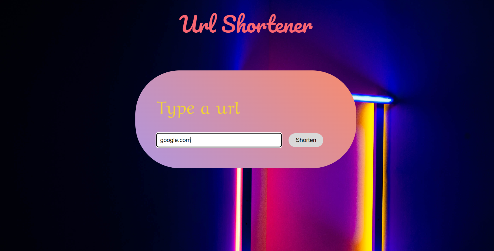
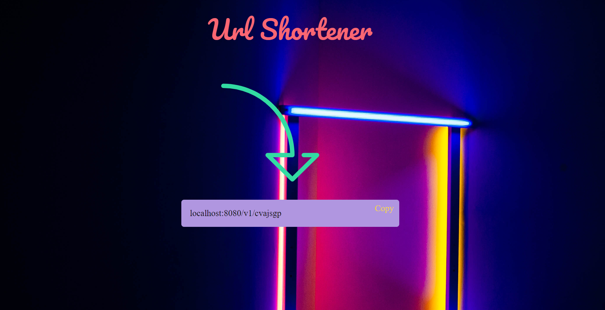

# Url Shortener

It is a basic full stack url shortener application. You should enter a url and then wait for it to transform the url to a shortened version. Shortened urls are being created by using Random class. 
Also, I used hashmaps to keep track of urls and corresponding shortened urls.

### Frontend
 I used React for frontend. [Parcel](https://parceljs.org/) is used as a bundler for the project, [React router](https://reactrouter.com/en/main) is used for routing
 
### Backend
I used Java, Spring Boot to create api.

## Screenshot
 
